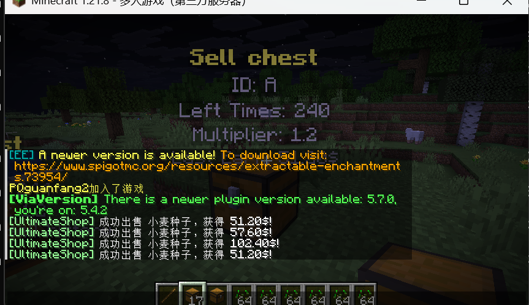

# 🎁Sell Chest - Premium


The **sell chest** feature is not currently introduced as a core function of UltimateShop and is still in the early testing phase. It may be officially released in future versions or potentially removed if it contains irreparable critical issues. \
Sell chest is now available at **4.2.0b or later** version.



Sell chest placed before you update to **4.2.6** version will no longer work after upgrade, This is due to a change in the logic for storing the location of the sell chest. You can ask the player to replace the sell chest to resolve this issue.


## Limitation

* Folia server does <mark style="color:red;">**NOT**</mark> support this feature.
* Sell chest cannot form a double chest with other chests.
* The data and location of sell chest is stored in the world itself, and the plugin itself does not store sell chest. If your world is damaged, you cannot recover the relevant data of sell chest.&#x20;
* If your server crashes unexpectedly and the world experiences a rollback, then the same applies to sell chest. However, your economy plugin may store the profits generated by players selling items, so there is a risk of duplicate economy in this situation.
* Sell chest only supports listening common changes made to the blocks in vanilla, such as block break, explosions, etc. If there are unexpected situations or changes made to the blocks by other plugins, it may result in the sell chest actually being destroyed in the world, but the plugin didn't find this and still think exists as a chest. If you enable the hologram, you may find that the hologram still exists, but the chest has been damaged.
* It is not possible to calculate the total earn of sell chest because UltimateShop supports multiple price types for a single product, rather than many plugins of the same type having one item stack corresponding to a double type **Vault** price. If that's the case, then only the logic of adding numbers can be implemented, but unfortunately, UltimateShop not only supports products **Vault** prices, you can even use custom fake prices, so it is very hard to calculate total earn, but last earn is supported to display in hologram.
* You may also discover other areas that have not been implemented as expected.

## Note

* Sell chest will only work both the chunk is loaded and the owner is online. No plan to support multi players share same sell chest.
* Only players who place sell chests will be considered owners. But all players can destroy the sell chest.
* Products that using dynamic price is also supported in sell chest. For example, you set each time the sell price decreases by $1, with a base price of $10, selling X units of this product would result in a total of $10 + $9 + $8 + $7 + $6 + $5, etc.

## Config

All sell chest configs are stored at `sell_chests` foler, an example of it's config is like below:

```yaml
display-item:
  material: CHEST
  name: '&dSell Chest &7(500 times)'
  lore:
    - '&fPlace this chest in your world to sell items!'
    - ''
    - '&cLeft usages: {times}'

usage-times: 500

multiplier: 1.2

y-offset: 2.25
holograms:
  - '&e&lSell chest'
  - '&7ID: {id}'
  - '&7Left Times: {usage}'
  - '&7Multiplier: {multiplier}'
  - '&7Last Earn: {price}'

actions:
  1:
    type: sound
    sound: 'block.note_block.pling'

conditions: []
```


The display item of sell chest <mark style="color:red;">**ONLY**</mark> support use **CHEST** as material. Otherwise, it won't work!


The most thing is same as [Sell Stick](sell-stick-premium.md), I will only tell you about different things:

* holograms: The content of the hologram showed above sell chest. Require DecentHolograms.
* y-offset: The height deviation of the hologram compared to the sell chest can be adjusted according to the number of rows in the hologram.

## Setting in config.yml file

```yaml
  sell-chest:
    enabled: true
    debug: false
    period-ticks: 600
    batch-count: 5
    send-sell-message: true
    price-empty: '{lang}'
    hologram:
      enabled: true
      # Support value: DecentHolograms, CMI
      plugin: 'DecentHolograms'
```

* enabled: Whether use this feature. If you do not need this feature and want to has better performance, you can try disable this option.
* debug: Will pring debug info at console related to sell chest after enable.
*   perior-ticks and batch-count:

    #### `period-ticks: 600`

    Controls how often the sell chest system runs. In this example:\
    The value is in **Minecraft ticks** (20 ticks = 1 second).

    * `600 ticks = 30 seconds`
    * Every 30 seconds, the system processes **one batch** of sell chests.

    #### `batch-count: 5`

    Controls how many **batches** all sell chests are divided into per cycle. In this example:

    * All sell chests are split into **5 batches**
    * **Only one batch is processed each period**
    * A full cycle requires **5 executions**

    The purpose of doing this is to save server performance. We will not set separate loop timers for each sell chest to avoid server performance degradation caused by too many sell chests, nor will we arrange all sell chests in the same loop timer to cause server lag.
* send-sell-message: Whether we will send message after each sell.
* price-empty: The text displayed in hologram if there is no history for the sell chest.
* hologram: Settings for the hologram feature.&#x20;
  * enabled: Whether display holgoram above sell chest.
  * plugin: Set hologram plugin. For list of supported plugin, please click [here](../info/compatibility.md#directly-supported-protection-plugins-list-premium-1).

## Showcase

<figure><figcaption></figcaption></figure>
