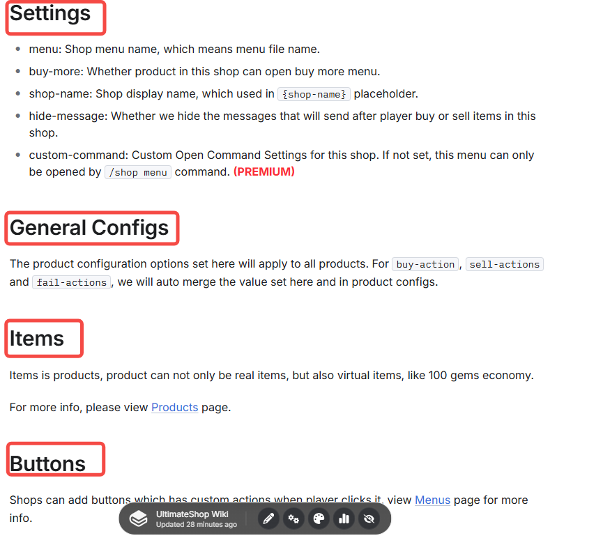
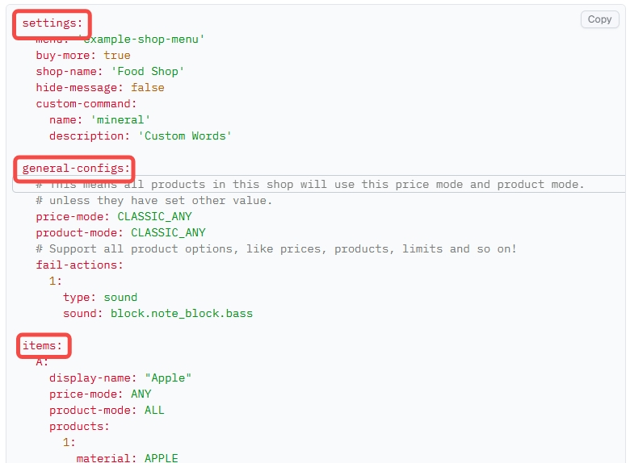
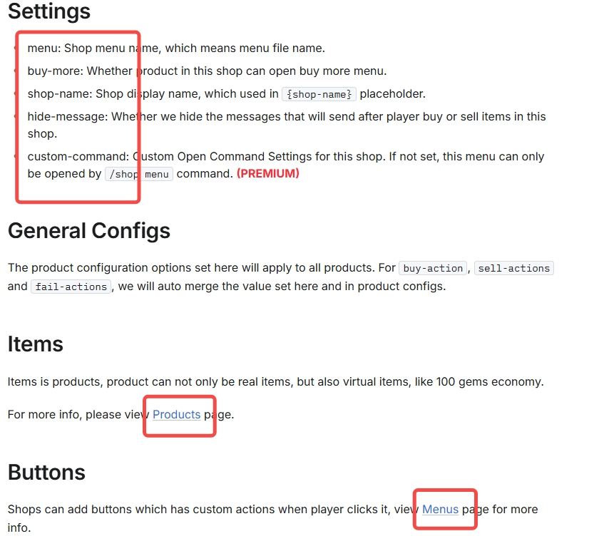
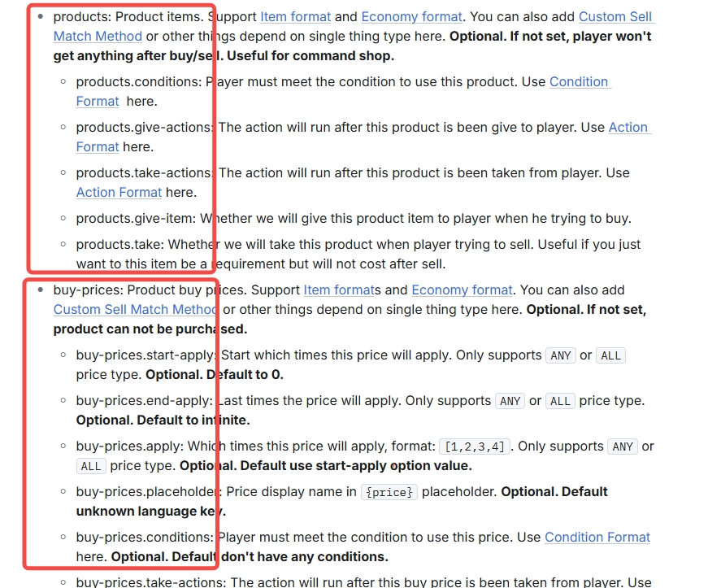
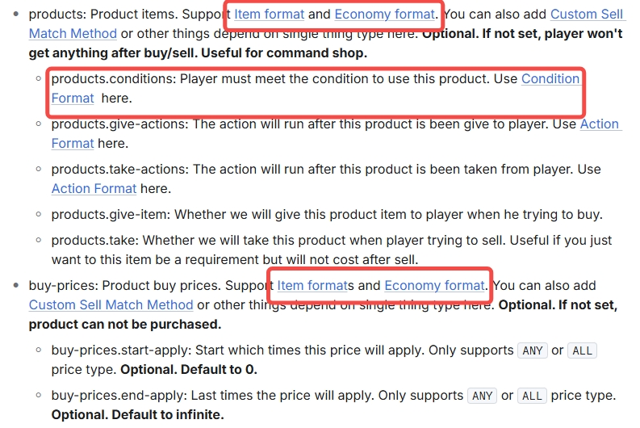

# 📊Understanding YAML/This wiki

In the UltimateShop plugin, all configuration files use the YAML format. Understanding YAML syntax is essential for editing and customizing your setup. Let’s go through it with real examples from the plugin.

***

## Basic Syntax

The basic structure of YAML is `key: value`. Example:

```yaml
debug: false
```

Important Rules:

1. Keys are case-sensitive.
2. There must be a space after the colon.
3. When the value contains special characters (`:` or `&`), wrap it in quotes: `prefix: "&a[UltimateShop]"`
4. When the value contains a single quote (`'`), escape it with two single quotes: `message: "You can''t buy this item!"`

## Hierarchy & Indentation

Indentation represents parent-child relationships in YAML. Each level must be indented by two spaces. Example:

```yaml
auto-save:
  hide-message: false
```

Here:

* `auto-save` is the parent key.
* `hide-message` is its child key, means this option only work for auto save feature.
* `false` is the value, means we will not hide message when auto save.

Let us take shop configs as complex example:

```yaml
settings:
  menu: 'example-shop-menu'
  buy-more: true
  shop-name: 'Blocks Shop'
  hide-message: false

items:
  A:
    price-mode: CLASSIC_ALL
    product-mode: CLASSIC_ALL
    products:
      1:
        material: GRASS_BLOCK
        amount: 1
    buy-prices:
      1:
        economy-plugin: Vault
        amount: '0.63'
        placeholder: '{amount}$'
```

1️⃣ Level 1 (Top Level) There are two main root keys:

* settings
* items

They exist side by side at the top of the configuration. This is shop configs, so you should get available top level options at [Shops](../shops/shops.md) page. In that page, we told you available keys with very big font size.

<figure><figcaption></figcaption></figure>

with very detalied example.

<figure><figcaption></figcaption></figure>

All of them has detelied info:

<figure><figcaption></figcaption></figure>

2️⃣ Level 2 Under `settings`:

* menu
* buy-more
* shop-name
* hide-message\
  are all **child keys** of settings.

This means all of them are settings for this shop. Put them in other place will <mark style="color:red;">**NOT**</mark> work.

Under items:

* **A** is a **child key** representing a product. `A` means this product ID is `A`, and all section under `A` will only work for this product.

<pre class="language-yaml"><code class="lang-yaml"><strong>items:
</strong><strong>  buy-prices: # Will not work
</strong>      1:
        economy-plugin: Vault
        amount: '0.63'
        placeholder: '{amount}$'
  A:
    menu: 'example-shop-menu' # Will not work.
    buy-more: true # Will not work.
    shop-name: 'Blocks Shop' # Will not work.
    hide-message: false # Will not work.
    price-mode: CLASSIC_ALL # Only work for product A
    product-mode: CLASSIC_ALL # Only work for product A
    products: # Only work for product A
      1:
        material: GRASS_BLOCK
        amount: 1
</code></pre>

3️⃣ Level 3 Under `items` → `A`:

* price-mode
* product-mode
* products
* buy-prices
* and so on.\
  are all **children** of `A`. All of those options will only work for product A, and should not put them in other place.

<figure><figcaption></figcaption></figure>

Since it is product config, you can get all options available at [Products](../shops/products.md) page with detalied info.

```yaml
items: # Will work.
  B: # Will work.
    products: # Will work.
      1: # Will work.
        material: APPLE # Will work.
        amount: 64 # Will work.
        give-actions: # Will work.
          1: # Will work.
            multi-once: true # Will work.
            type: message # Will work.
            message: 'eco give {player} {amount}' # Will work.
```

4️⃣ Level 4 Under `products`:

* “`1`” means the first defined product.&#x20;

Under buy-prices:

* “`1`” means the first defined price set.

You can set unlimited sub price and product. All of those options available at [Single Things](../shops/products-config-single-thing/) page.

5️⃣ Level 5 Under `products` → `1`:

* `material: GRASS_BLOCK` → the item type.
* `amount: 1` → the quantity.

They are following [ItemFormat](itemformat-tm/).

Under `buy-prices` → `1`:

* `economy-plugin: Vault` → the economy system used.
* `amount: '0.63'` → the price.
* `placeholder: '{amount}$'` → how the price is displayed.

They are following [EconomyFormat](economyformat-tm.md) and placeholder option inside price section.

<figure><figcaption></figcaption></figure>

## Hierarchical Tree Diagram

```fish
settings
│
├─ menu
├─ buy-more
├─ shop-name
└─ hide-message

items
└─ A
   ├─ price-mode
   ├─ product-mode
   ├─ products
   │   └─ 1
   │      ├─ material
   │      └─ amount
   └─ buy-prices
       └─ 1
          ├─ economy-plugin
          ├─ amount
          └─ placeholder
```

## Lists

When a key holds multiple values, use a list.&#x20;

Example:

<pre class="language-yaml"><code class="lang-yaml">menu:
  secret-shop-items:
    - diamond_sword
<strong>    - netherite_pickaxe
</strong>    - enchanted_golden_apple
</code></pre>

Each “`-`” must be indented two spaces from its parent key.

## Empty and Default Values

An empty list is represented as:

```yaml
menu:
  secret-shop-items: []
```

The `[]` means the list is empty, and the plugin will use its default settings.\
This line can usually be safely removed.
