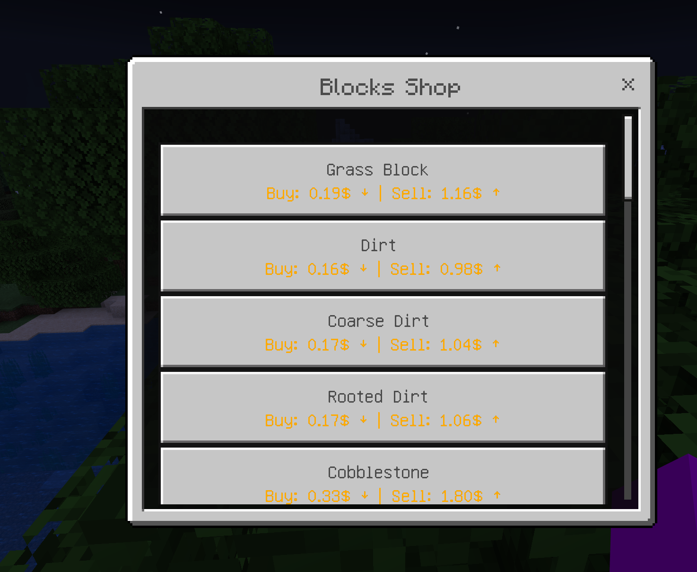

# 🛏️Bedrock Menus - Premium


## Bedrock Menu share same menu files with dialog menus and classic inventory menus. We can auto translate the menu into 3 different types, you do not need any manually change.


## Requirements

* Both Geyser and Floodgate are **required in your Spigot server**. If you are using BungeeCord proxy, you need install them both in backward server and proxy server.
* You must set Geyser's `auth-type` to **`floodgate`**.&#x20;
* You need carefully follow [those steps](https://geysermc.org/wiki/floodgate/setup/?platform=proxy-servers) to setup floodgate in your backend server if you are using BungeeCord.


If your server is correctly installed and configured with floodgate, the console will prompt `Hooking into floodgate` when UltimateShop start to run. If this prompt didn't appear but if you insist that your server has a floodgate, it is very likely that you accidentally downloaded the free version of the plugin. The <mark style="color:red;">**PREMIUM**</mark> version will have a special prompt at startup.


* All bedrock players will use the new UI. If not, you can try set `menu.bedrock.check-method` option value from **FLOODGATE** to **UUID** in `config.yml`.
* Bedrock UI is auto generated and don't need any manual modification.

<figure><figcaption></figcaption></figure>

## Extra options for bedrock buttons

If you want to modify those bedrock buttons, you need add `bedrock` section at button or product config's `display-item` section, for example:

```yaml
  A:
    display-item:
      material: GRASS_BLOCK
      bedrock:
        hide: false
        icon: 'url;;https://raw.githubusercontent.com/Jens-Co/MinecraftItemImages/main/1.20/melon_slice.png'
```

or

```yaml
  B: 
    display-item:
      1:
        material: GRASS_BLOCK
        bedrock:
          hide: false
          icon: 'url;;https://raw.githubusercontent.com/Jens-Co/MinecraftItemImages/main/1.20/melon_slice.png'
    display-item-conditions:
      1:
        type: permission
        permission: 'test'
```

If your product configs do not has `display-item` section, you can simply add `bedrock` section under your product configs section, or add them at single product section, for example:

```yaml
  D:
    price-mode: ANY
    product-mode: CLASSIC_ALL
    # Plan A
    bedrock:
      hide: false
      icon: 'url;;https://raw.githubusercontent.com/Jens-Co/MinecraftItemImages/main/1.20/melon_slice.png'
    products:
      1:
        material: melon_slice
        amount: 1
        # Plan B
        bedrock:
          hide: false
          icon: 'url;;https://raw.githubusercontent.com/Jens-Co/MinecraftItemImages/main/1.20/melon_slice.png'
    buy-prices:
      5:
        economy-type: exp
        amount: 2
        placeholder: '&6{amount} e'
        start-apply: 0  
      2:
        economy-type: levels
        amount: 5
        placeholder: '&6{amount} e1'
        start-apply: 0 
    sell-prices:
      1:
        economy-plugin: Vault
        amount: 1
        placeholder: '&6{amount} Coins'
        start-apply: 0
```

For now, we support those options for bedrock buttons

* icon: The icon of this button, format is `path;;<image path> or url;;<image url>`. The image path is bedrock texture path, not your plugin path, for example: `path;;textures/blocks/stone_granite.png`.


For auto add icon feature, please view below.


For example:

<figure><figcaption></figcaption></figure>

with the product config (menu buttons are similar):

* hide: Hide button for bedrock players.
* extra-line: Display second line at bedrock button, supports `{buy-price}` and `{sell-price}` placeholder for products.

## Extra options for bedrock menu

You can add those extra options for menu configs. For example:

```yaml
title: '{shop-name}'
size: 54

# Added line
bedrock:
  enabled: true
  content: 'test'

open-actions:
  1:
    type: sound
    sound: 'item.book.page_turn'
```

* enabled: Whether we will auto open bedrock form UI to player. Only work for common type menu. Other menu types like shop menu, buy more menu and sell all menu are not work by this option. If you want to disable for all menus, there is a option called `menu.bedrock.enabled` at `config.yml` file.
* content: The head content of the bedrock menu. Only work for common type menu, shop menu. Other menu types like buy more menu and sell all menu are not work by this option.

## Price Extra Line

You can enable price extra line feature in `config.yml` file, after enable, all products button will display it's price at second line. Make the option value to empty to disable this feature.

```yaml
  # Premium version only
  bedrock:
    # Make this option be empty to disable.
    price-extra-line:
      default: '&6Buy: {buy-price} &6| Sell: {sell-price}'
      only-buy: '&6Buy: {buy-price}'
      only-sell: '&6Sell: {sell-price}'
```

<figure><figcaption></figcaption></figure>

## Auto Add Icon - 4.7.0+

If you think manually adding icons to each button is too troublesome, the plugin supports the function of automatically setting icons, and configuration options can be found in `config.yml`.

```yaml
menu:
  bedrock:
    auto-add-icon:
      enabled: true # Set this to true.
      format: "https://raw.githubusercontent.com/InventivetalentDev/minecraft-assets/refs/heads/{version}/assets/minecraft/textures/{path}.png"
    
```

Before you use this feature, you have to download the material -> vanilla text path mapping, find the content in config.yml file:

```yaml
  # Premium version only. Generates a Material -> vanilla texture path mapping from the Minecraft client assets.
  minecraft-item-material-file:
    enabled: false
    generate-new-one: false
    file: 'item-materials.json'
```

* Set both `enabled` and `generate-new-one` option to `true`.
* Stop your server and restart it.
* Plugin will auto download the file.
* After successfully download, you need set `generate-new-one` to `false`. **If your server upgraded game version, you need delete old mapping file and regenerate new one.**

By default, we use Minecraft vanilla assets provided by this [GitHub repository](https://github.com/InventivetalentDev/minecraft-assets), which you see in the `format` option. In `format` option, we supports those placeholders:

* {version} - The server version, like `26.1`.
* {path} - The path of the material in vanilla assets, like `block/sunflower_front`.

You can also use these placeholders with URLs from other places. We only support matching various icons through materials. If your item has custom textures or models, we recommend manually setting the bedrock icon, as mentioned earlier.

<figure><figcaption></figcaption></figure>
