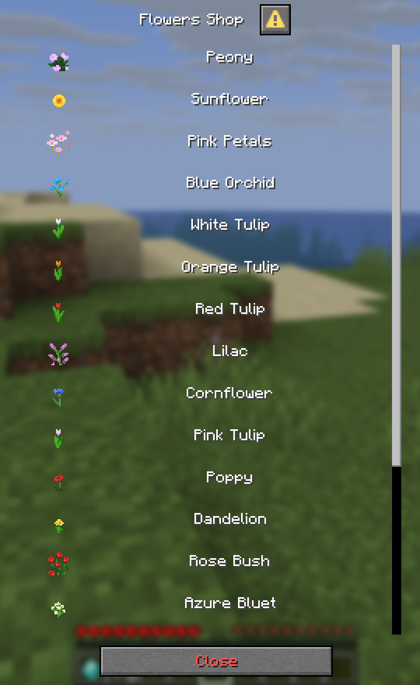

# 💬Dialog Menus - Premium

Dialog menus use Minecraft's native Dialog UI. They reuse the menu files, products, buttons, conditions and actions used by inventory and Bedrock menus.

This feature requires **UltimateShop Premium 4.7.0+**, **Paper 1.21.9+** and a **Java client that supports Dialogs**. The Ore layout also requires a generated resource pack.

## Quick start

Enable the feature in **`config.yml`**:

```yaml
menu:
  dialog:
    enabled: true
```

Then enable it in the **menu file**:

```yaml
dialog:
  enabled: true
  layout: multi-action
  content: '<gray>Select a product or action.'
  button-width: 150
  columns: 2
```

Supported menus use Dialog instead of the inventory UI for Java players. Bedrock players continue to use the configured Bedrock presentation. Some specialized menu types do not support Dialogs.

Choose a layout:

| `dialog.layout` | Appearance | Resource pack |
| --- | --- | --- |
| [`multi-action`](#multi-action-layout) | Native action buttons in columns; the default layout | Not required |
| [`item-action-list`](#item-action-list-layout) | A vertical list of item icons with clickable labels | Not required for vanilla items |
| [`ore`](#ore-layout) | Graphical product cards and navigation buttons | Required |

The inventory `layout` still determines which entries appear and their order. Display items with blank names do not create Dialog buttons.

### Closing menus

Dialogs do not use Escape to close because the client does not notify the server when it closes the UI that way. Use a button with a direct [`type: close`](../format/action-format.md#close) action to run the menu's `close-actions` reliably:

```yaml
# Menu file: include x in the inventory layout.
buttons:
  x:
    display-item:
      material: BARRIER
      name: '{lang:close-button}'
    actions:
      1:
        type: close
```

In `item-action-list` and Ore, close buttons appear in the native footer. If no footer button is available, the plugin generates one using `menu.dialog.default-button`.

### Shared menu settings

These settings belong in the menu file:

| Setting | Default | Purpose |
| --- | --- | --- |
| `dialog.enabled` | Must be enabled for the menu | Uses Dialog when the global feature is enabled |
| `dialog.content` | Empty | Body text below the title; supports language references and MiniMessage |
| `dialog.layout` | `multi-action` | Selects the presentation |
| `dialog.button-width` | `150` | Width of native action buttons, including footer buttons |
| `dialog.columns` | `2` | Native button columns in `multi-action`; product columns in Ore |

## Multi-action layout

`multi-action` is the default layout. Each visible entry becomes a native action button, with the number of columns and button width controlled by the menu file. Product buttons open the product information Dialog; other buttons run their configured actions. Hovering a button shows its lore tooltip when present.

```yaml
dialog:
  enabled: true
  layout: multi-action
  content: '<gray>Select a product or action.'
  button-width: 150
  columns: 2
```

Use `dialog.columns` to arrange buttons across multiple columns and `dialog.button-width` to change their width. This layout does not use Ore templates, graphical positions or a generated resource pack. Labels can include native sprites as described in [Native sprite settings](#native-sprite-settings).

## Item action list layout

`item-action-list` displays a native item icon on the left and a clickable text label on the right. Product labels open product information; other labels run their configured button actions.

With `menu.dialog.auto-add-sprite.auto-hide: true` (the default), sprites in the text label are hidden when the row already has a non-air item icon. Ore uses the same rule when its large icon is actually available. Other buttons retain their sprites. Set `auto-hide: false` to keep sprites alongside item icons.

Each product/button can override the automatic rule using `dialog.show-sprite`. `true` shows sprites even alongside icons; `false` hides label sprites even without a separate icon; omitting it uses the automatic rule. Text, formatting, tooltips, and item icons are preserved. Sub buttons inherit the target product's setting when omitted.

```yaml
# config.yml
menu:
  dialog:
    auto-add-sprite:
      enabled: true
      auto-hide: true
```

```yaml
# Product or button settings
buttons:
  example:
    dialog:
      show-sprite: false
    display-item:
      material: DIAMOND
      name: 'Example'
```

```yaml
dialog:
  enabled: true
  layout: item-action-list
  content: '<gray>Select a product or action.'
  button-width: 150
```

Set `dialog.layout: item-action-list` for item icons with clickable text on the right. This layout always uses one vertical column; `dialog.columns` does not change the list.

Hovering an icon shows the native item tooltip. Hovering its clickable label shows the configured lore tooltip when present.

<figure><figcaption>Item action list layout</figcaption></figure>

### Mix native button layouts

Within a `multi-action` or `item-action-list` menu, individual buttons can use either native layout:

```yaml
buttons:
  category:
    dialog:
      layout: item-action-list
```

`buttons.<id>.dialog.layout` accepts `multi-action` and `item-action-list`. When omitted, the button inherits the menu's layout. Ore widgets use templates and positions instead of this native layout override.

## Ore layout

Ore supports common menus and shop menus. Shop products appear as cards; the details bar opens a product information Dialog where players can buy or sell. Named buttons appear in the left rail, and blank decorative inventory buttons are skipped.

### Generate and load the resource pack

1. Enable `menu.dialog.enabled` in `config.yml`.
2. Set `dialog.enabled: true` and `dialog.layout: ore` in the menu file.
3. Restart the server or run `/shop reload`. On supported Paper servers, the plugin generates `plugins/UltimateShop/pack/` only when Dialog is globally enabled and an enabled menu uses Ore. Spigot servers skip generation.
4. Load that folder as a client resource pack, or merge `pack/assets/` into your server resource pack and include the appropriate pack metadata.

Generation does **not** upload or automatically send the pack. Players must load it before opening Ore menus; otherwise the graphics appear as missing glyphs.

The generated `pack/` folder is replaced during regeneration. Keep custom source PNGs in `plugins/UltimateShop/textures/`. If generation fails, the previous pack is retained.

| Command | Purpose |
| --- | --- |
| `/shop reload` | Reloads configuration and rebuilds the Ore pack |
| `/shop dialogpack` | Rebuilds the pack from the loaded configuration |
| `/shop dialogpack 75` | Rebuilds using a specified pack format |

Manual generation requires `ultimateshop.dialogpack` (default: op).

Regenerate and reload the client pack after changing template dimensions, colors, textures, icons, positions or visibility conditions. Text and action changes require configuration reloads but do not require rebuilding the resource pack.

#### Pack format

The format is selected from the server's Minecraft version. To override it, set this in **`config.yml`**:

```yaml
menu:
  dialog:
    ore:
      pack-format: 0 # Automatic; use a positive value to override.
```

The plugin's built-in mapping is:

| Minecraft version | Pack format |
| --- | --- |
| 1.21.9–1.21.10 | 69 |
| 1.21.11 | 75 |
| 26.1.x | 84 |
| 26.2.x | 88 |
| 26.3.x | 97 |

Newer versions use the latest listed format until support is updated. A positive override can also be useful when the client uses a different pack format from the server.

### Menu layout and templates

The bundled `shop_menu_templates/example-shop-menu.yml` contains Ore settings while keeping `multi-action` selected by default. This example shows the Ore section of a menu file:

```yaml
dialog:
  enabled: true
  layout: ore
  width: 576
  height: 396
  columns: 2
  sidebar:
    enabled: true
    menu: main
    template: button
    x: 12
    gap-y: 9
  products:
    template: product
    x: 144
    y: 18
    gap-x: 12
    gap-y: 9
  templates:
    product:
      type: product
      # Width fits the available area and dialog.columns automatically.
      height: 108
      padding: 12
      icon-size: 32
      name-y: 9
      name-lines: 1
      lore-y: 27
      lore-lines: 6
      details-y: 81
      text-align: left
      background: '#262c36'
      border: '#596373'
      accent: '#83cfce'
      footer: '#294b54'
    button:
      type: button
      width: 96
      height: 36
      name-lines: 2
      text-align: center
      background: '#303846'
      border: '#596373'
      accent: '#83cfce'
      selected-background: '#244A32'
      selected-border: '#65D98B'
```

The built-in templates are `product` and `button`. Define custom templates under `dialog.templates.<name>` with `type: product` or `type: button` to inherit the corresponding defaults. Only templates used by menu entries are included in the pack.

All visible products appear in inventory-layout order in one scrollable Dialog. The default product grid starts at `(144, 18)`, uses two columns and has horizontal/vertical gaps of `12`/`9` pixels. The body grows vertically to fit products and sidebar entries.

#### Positions and visibility

Set `dialog.template` and `dialog.position` on a shop product or menu button:

```yaml
# Shop file: the product's other settings remain in this section.
items:
  A:
    dialog:
      template: product
      position: {x: 144, y: 18}
```

For menu-specific overrides, use `dialog.slots.<inventory-slot>.template` and `.position` in the menu file. Slot overrides take priority over product/button settings.

You can also supply a list of `{x, y}` values at `dialog.products.positions`. It is used when it covers every visible product; otherwise products use the grid.

Set `dialog.enabled: false` on a product/button, or `dialog.slots.<slot>.enabled: false` in the menu file, to hide an Ore widget. For presentation-specific visibility across menu types, see [Button visibility by menu presentation](general-menus.md#button-visibility-by-menu-presentation).

Close buttons use the native footer and ignore Ore templates and positions.

#### Layout constraints

Coordinates are Minecraft GUI pixels relative to the graphical body. Template heights, vertical positions and vertical gaps use multiples of 9. Widgets must fit the body without overlapping. Invalid settings are logged and replaced with a closeable error Dialog.

Small windows or large GUI Scale values may require scrolling. Custom fonts and client translations can affect alignment; check the result in game with the intended resource pack and GUI Scale.

### Titles, lore and hover text

| Template option | Button default | Product default | Purpose |
| --- | --- | --- | --- |
| `height` | `36` | `108` | Widget height in GUI pixels |
| `name-lines` | `2` | `1` | Maximum title lines, from 1 to 60 |
| `name-y` | Automatic | `9` | First title row; omit for vertically centered button titles |
| `lore-y` | `27` | `27` | First lore row |
| `lore-lines` | `0` | `6` | Maximum visible lore lines |
| `details-y` | Not used | `height - 27` | Top of the product details bar |

Text wraps at the available width. Lines are 9px apart, and text exceeding the available lines ends with `...`. The title and lore limits also respect the space reserved by the template; increase the height and move the details bar when allowing more product lore lines.

#### Separate card body and tooltip

Ore uses the existing global `display-item.add-lore` or per-product `add-lore` for both card text and hover text. It filters them separately:

| Condition prefix | Where the line appears |
| --- | --- |
| `@t[ore]` | Ore card body |
| `@t[ore-hover]` | Ore hover tooltip |
| `@t[ore,ore-hover]` | Both |
| `(@t[ore])` | Tooltips and other presentations, excluding the Ore body |
| No `@t` condition | Both, when the line's other conditions match |

The tooltip also retains the item's original lore. The body contains auto-added lore. There is no separate fixed field list or dedicated Ore lore format.

For example, in a product's configuration:

```yaml
add-lore:
  - '@a@t[ore,ore-hover]&ePurchase: {buy-price}'
  - '@b@t[ore,ore-hover]&eSell: {sell-price}'
  - '@c@t[ore]&#FF7777Player Buy: {buy-times-player}/{buy-limit-player}'
  - '@e@t[ore]&#FF7777Player Sell: {sell-times-player}/{sell-limit-player}'
  - '@d@t[ore]&#FF7777Server Buy: {buy-times-server}/{buy-limit-server}'
  - '@f@t[ore]&#FF7777Server Sell: {sell-times-server}/{sell-limit-server}'
  - '@t[ore-hover]&7Additional tooltip information'
```

Each field appears only when its price/limit condition matches. The maximum displayed card lines is controlled by the product template's `lore-lines`. See [Display Item Add Lore](display-item-add-lore.md) for all conditions, negation and language-based formats.

### Shop navigation sidebar

Ore shop menus import navigation buttons from `menus/main.yml` into the left rail by default. The source menu's inventory layout determines their order. Entries must contain a direct `shop_menu` or `open_menu` action; entries with a direct `close` action are not imported.

The sidebar reuses the source buttons' display items, names, lore, actions and visibility conditions. The source menu's opening conditions are checked both when displaying and clicking entries. Ordinary Dialog and Form menus do not import this sidebar.

| `dialog.sidebar` option | Default | Purpose |
| --- | --- | --- |
| `enabled` | `true` | Enables the sidebar on Ore shop menus |
| `menu` | `main` | Source common menu |
| `template` | `button` | Button template from the current Ore menu |
| `x` | `12` | Horizontal position |
| `y` | Below the shop menu's existing left-rail buttons | Optional starting position |
| `gap-y` | `9` | Vertical gap between entries |

Entries must fit to the left of `dialog.products.x`. The body grows to fit them; there is no sidebar pagination. `menu-visibility.ore`, `dialog.enabled` and source-menu slot visibility settings also apply.

#### Highlight the current destination

Navigation buttons in both the sidebar and the menu itself highlight their current destination. `shop_menu` matches the shop ID, distinguishing shops that share a template; `open_menu` matches the common menu ID. With several direct navigation actions, the last in execution order determines the destination (`multi-once` actions run first).

The default selected frame uses a dark green background and bright green border/accent. Customize it in the menu file:

```yaml
dialog:
  templates:
    button:
      selected-background: '#244A32'
      selected-border: '#65D98B'
      # Optional source PNG relative to plugins/UltimateShop/textures/:
      # selected-texture: ore/selected-button.png
```

Without `selected-texture`, selected colors are used even when the normal frame has a custom texture. Clicking a selected button still runs its actions. Both states are generated together, so changing menus does not require regenerating the pack.

### Ore icons and background textures

Product icons are separate from native sprites in button labels:

| Graphic | Default size | Control |
| --- | --- | --- |
| Ore product icon | 32×32 GUI pixels | Template `icon-size`; global `menu.dialog.ore.show-item-icon.enabled` |
| Native sprite in a Dialog label | 8×8 | `menu.dialog.auto-add-sprite.enabled` |

To hide Ore icons, set **`menu.dialog.ore.show-item-icon.enabled: false` in `config.yml`**. The default is `true`. With icons hidden, names and lore use the full text area, and rebuilding omits their icon textures/font mappings.

Ore retains text product names even when `display-item.auto-use-sprite-item-name` is enabled.

Ore draws the final display-item count as plain white text with a dark shadow over the lower-right part of the product icon (for example `10`). By default, `menu.dialog.ore.show-item-icon.auto-hide-one: true` hides this text when the count is `1`; set it to `false` to show `1` too. The icon remains visible. The text is separate from the icon texture and does not change the item or trade amount. Hidden icons have no overlaid text. No additional resource-pack assets are required.

```yaml
menu:
  dialog:
    ore:
      show-item-icon:
        enabled: true
        auto-hide-one: true
```

#### Product icon sources

Set a complete `sprite` expression in the product's `display-item` section to override the Material icon:

```yaml
items:
  A:
    display-item:
      material: DIAMOND
      name: '&bRuby'
      sprite: '<sprite:"minecraft:items":item/diamond>'
```

Vanilla icon images are downloaded automatically. For a custom PNG, use a namespaced texture path:

```yaml
sprite: '<sprite:"minecraft:items":myshop:item/ruby>'
```

Place the square source PNG at `plugins/UltimateShop/textures/ore/icons/myshop/item/ruby.png`. Paths use lowercase names and forward slashes; the image is scaled to `icon-size`.

Ore can use this PNG without registering it in a client sprite atlas. To use the same path as a native 8×8 sprite, register it in the client's selected atlas as well.

Custom-item models, including CraftEngine models, are not automatically rendered into PNGs. Without an explicit icon source, lookup may show the underlying vanilla Material or fall back to a native sprite.

#### Frame backgrounds

Set a template's `texture: ore/my-frame.png` and place the source at `plugins/UltimateShop/textures/ore/my-frame.png`. It is scaled to the template dimensions; transparent areas reveal the configured base frame. `selected-texture` works the same way for selected buttons.

A template's `texture` changes the frame, not the product icon. Product icon sources belong under `textures/ore/icons/`.

## Native sprite settings

These options apply to native sprites in labels and messages, independently of Ore's enlarged icons.

### Automatic Material mapping

Configure **`config.yml`**:

```yaml
config-files:
  minecraft-item-material-file:
    enabled: true
    generate-new-one: true
    file: 'item-materials.json'
menu:
  dialog:
    auto-add-sprite:
      enabled: true
      format: '<sprite:"{namespace}:{atlas}":{path}>'
```

Restart the server to download the mapping, then set `generate-new-one: false`. After upgrading the Minecraft version, delete the old mapping file and regenerate it.

<figure><figcaption>Automatic sprites in button labels</figcaption></figure>

### Explicit sprites

Use a complete MiniMessage expression, not a bare texture path:

```yaml
display-item:
  material: SUNFLOWER
  name: '<yellow>Sunflower'
  sprite: '<sprite:"minecraft:blocks":block/sunflower_front>'
```

Material mapping uses the underlying Material. Supply an explicit sprite for custom items when that icon is not appropriate.

### Sprites in product messages

Set this in **`config.yml`** to use an available sprite as the product name in messages. This requires Paper 1.21.9+ and Java players:

```yaml
display-item:
  auto-use-sprite-item-name: true
```

<figure><figcaption>Sprite product names in messages</figcaption></figure>

## Global text settings

These options belong under **`menu.dialog` in `config.yml`**:

| Option | Purpose |
| --- | --- |
| `default-button` | Fallback close button label |
| `not-auto-close` | Keeps product information open after buying/selling |
| `search.*` | Search input and button labels |
| `buy-more.*` | Amount selection labels and display-item setting |
| `info.display-item` | Shows the display item in the product information Dialog |
| `info.title`, `info.buttons.*` | Product information title and actions |
| `favourite-edit.*` | Favourite editing labels |

Values support `{lang:...}` references. Relevant product information strings also support `{item-name}` and `{amount}`. For example:

```yaml
menu:
  dialog:
    default-button: '{lang:menu.dialog.default-button}'
    not-auto-close: true
    info:
      display-item: true
      title: '{lang:menu.dialog.info.title}'
      buttons:
        buy: '{lang:menu.dialog.info.buttons.buy}'
        sell: '{lang:menu.dialog.info.buttons.sell}'
        back: '{lang:menu.dialog.info.buttons.back}'
```

## Common issues

| Symptom | Check |
| --- | --- |
| Inventory opens instead of Dialog | Server/client requirements, the global switch and the menu's `dialog.enabled` |
| Ore shows missing glyphs | The generated resource pack is loaded by the client |
| Graphics use old dimensions or colors | Reload configuration, regenerate the pack and update the client's pack |
| A long title or lore is truncated | Template width, line limits and the space before the lore/details area |
| Body and tooltip contain the same lines | Add `@t[ore]` or `@t[ore-hover]` conditions to separate them |
| English interface but Chinese vanilla product names | A fixed `minecraft-locate-file`, such as `zh_cn.json`, or a custom item/product name may override client translation |
| Invalid Ore layout error | Overlapping widgets, dimensions and vertical values that are not multiples of 9 |
