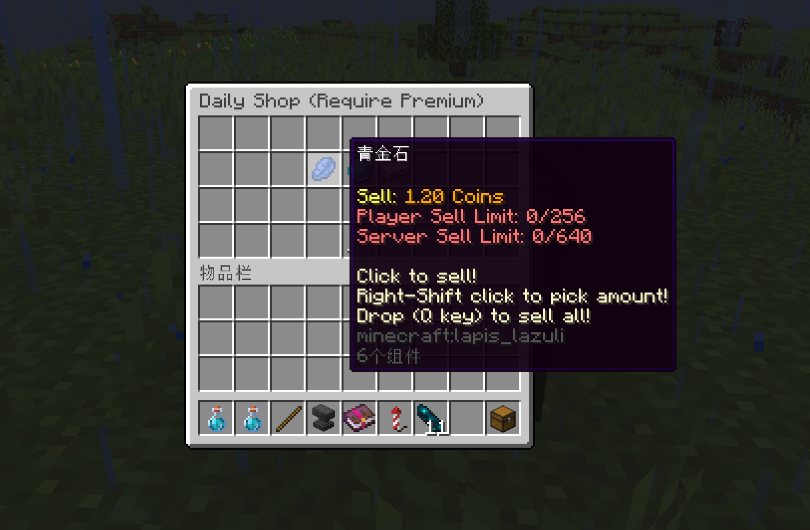

# 📅Example: Daily Shop/Rotating Shop


This example will only work for <mark style="color:red;">**PREMIUM**</mark> version of **UltimateShop**!\
This example is using random placeholder to display different product in one shop, you can also use conditinal placeholder to make different condition display different product, for example of it, please view [here](../placeholders/conditional-placeholder-premium.md#example-conditional-product).


## Create random placeholder

We need to create a random placeholder.&#x20;

In this example, we created a new random placeholder config called `daily.yml` at `random_placeholder` folder. And it's options represents:

* `reset-mode` and `reset-time`: This placeholder refreshed every day.
* `element-amount`: This placeholder will randomly pick 5 elements when it refresh, this is same as the amount of slots in this daily shop.
* `elements`: The result determines what product will appear in this slot by the condition system. So the quantity of elements should be equal to the quantity of all possible products in the daily shop.

In this example, this daily shop will has 5 slots and 7 possible products, so each day, it will has 2 products be hidden, and 5 products randomly picked to display in shop.

Please view [Random Placeholder](../placeholders/random-placeholder-premium.md) page for more info about random placeholder.

```yaml
reset-mode: TIMED
reset-time: '00:00:00'
element-amount: 5
per-player-element: false
element-sort: true
elements:
  - 'A'
  - 'B'
  - 'C'
  - 'D'
  - 'E'
  - 'F'
  - 'G'
```

## Configure Shop

The various options used in this example are detailed on the [Shops](shops.md) page. If you are unsure of the purpose of each option, please refer to that article.

```yaml
settings:
  menu: 'daily-shop-menu' # The menu ID
  buy-more: true
  shop-name: 'Daily Shop (Require Premium)'
  hide-message: false

general-configs:
  price-mode: CLASSIC_ANY
  product-mode: CLASSIC_ANY
  sell-limits:
    global: 640
    default: 18
    vip: 256
  sell-limits-conditions:
    vip:
      1:
        type: permission
        permission: 'group.vip'
  sell-times-reset-mode: 'COOLDOWN_TIMED'
  sell-times-reset-time: '{random_reset}'

items:
  A:
    products:
      1:
        material: REDSTONE
        amount: 1
    sell-prices:
      1:
        economy-plugin: Vault
        amount: 1
        placeholder: '&6{amount} Coins'
        start-apply: 0
  B:
    products:
      1:
        material: IRON_INGOT
        amount: 1
    sell-prices:
      1:
        economy-plugin: Vault
        amount: 3
        placeholder: '&6{amount} Coins'
        start-apply: 0
  C:
    products:
      1:
        material: GOLD_INGOT
        amount: 1
    sell-prices:
      1:
        economy-plugin: Vault
        amount: 1.6
        placeholder: '&6{amount} Coins'
        start-apply: 0
  D:
    products:
      1:
        material: COPPER_INGOT
        amount: 1
    sell-prices:
      1:
        economy-plugin: Vault
        amount: 2
        placeholder: '&6{amount} Coins'
        start-apply: 0
  E:
    products:
      1:
        material: DIAMOND
        amount: 1
    sell-prices:
      1:
        economy-plugin: Vault
        amount: 0.8
        placeholder: '&6{amount} Coins'
        start-apply: 0
  F:
    products:
      1:
        material: LAPIS_LAZULI
        amount: 1
      2:
        material: EMERALD
        amount: 1
    sell-prices:
      1:
        economy-plugin: Vault
        amount: 1.2
        placeholder: '&6{amount} Coins'
        start-apply: 0
      2:
        economy-plugin: Vault
        amount: 3.3
        placeholder: '&6{amount} Coins'
        start-apply: 0
  G:
    products:
      1:
        material: EMERALD
        amount: 1
    sell-prices:
      1:
        economy-plugin: Vault
        amount: 5
        placeholder: '&6{amount} Coins'
        start-apply: 0
```

## Configure Menu

The various options used in this example are detailed on the [Menus](../menus/general-menus.md) page. If you are unsure of the purpose of each option, please refer to that article.

```yaml
# PREMIUM version only.

title: '{shop-name}'
size: 36

open-actions:
  1:
    type: sound
    sound: item.book.page_turn

dynamic-layout: true

layout:
  - '000000000'
  - '000`{random_daily;;1}``{random_daily;;2}``{random_daily;;3}`000'
  - '000000000'
  - 'a0003000b'

buttons:
  3:
    display-item:
      material: ARROW
      name: '&c« Go back'
    actions:
      1:
        type: open_menu
        menu: main
```

## Showcase

<figure><figcaption></figcaption></figure>
