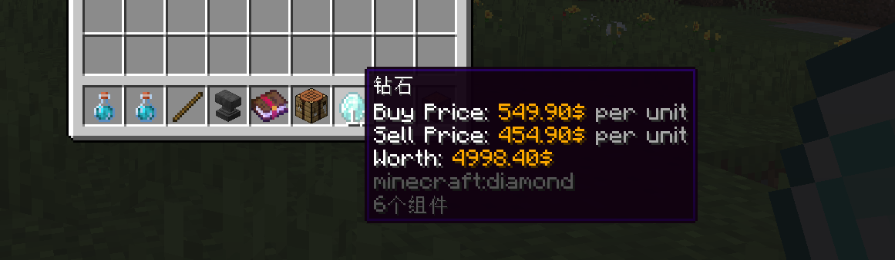

# Another version of 💰Products Config: Single Thing page

Each single product or price in one product we called **single thing**. So, each product have those thing type:

* Buy Prices: The buy price of this product, player need pay the buy price to obtain this product, if this thing type does not exist (which means `buy-prices` section does not exist in the config), this product can not be purcahsed.
* Sell Prices: The sell price of this product, player need sell the products to shop, then he will get the sell price you set here, if this thing type does not exist (which means `sell-prices` section does not exist in the config), this product can not be sold.
* Products: The products of this  product, player will get the products you set here after buy, and need give his products to shop when selling. If this thing type type does not exist (which means products does not exist in the config), then player won't get anything after buy it, and won't cost anything after sell it, however, option like `buy-actions, sell-actions, buy-conditions, sell-coditions` will still work as execepted.

## Single Thing Types

Each thing type can set unlimited related to single things, like set 5 buy prices, 100 sell prices and even 1k products!

Each single thing have those types:

* Vanilla Item: Use [ItemFormat](../../format/itemformat-tm/) to tell us what Minecraft item you want to sell in shop or you want to player pay. **(Buy/Sell/Products)**

```yaml
    products: # or buy-prices / sell-prices
      1:
        material: emerald
        custom-model-data: 15
      2:
        material: diamond
        amount: 16
```

* Hook Item: Use [Supported Plugins](../../info/compatibility.md)'s item to tell us what custom item you want to sell in shop or you want to player pay. This type still use [ItemFormat](../../format/itemformat-tm/). **(Buy/Sell/Products)**

```yaml
   products: # or buy-prices / sell-prices
      1:
        hook-plugin: MMOItems
        hook-item: 'AXE;;MAGIC_AXE'
```

* Match Item: Use [Custom Item Match Method](../../features/custom-item-match-method.md) to tell us which items you want to match. **(Buy/Products)**

```yaml
   # Because this product does not exist a real item, so we have to set display item for this product
   # Otherwise it can not be displayed in GUI.
   display-item:
      material: PAPER
      custom-model-data: 200
      name: '&fMagic Flight Paper &c(Level I)'
      lore:
        - '&fHold this and you can fly!'
   products: # or buy-prices / sell-prices
      1:
        # Custom Sell Match Rule - Explain the item match rule!
        match-item:
          contains-lore:
            - 'Magic Flight Paper'
        # Buy Give Command
        give-actions:
          1:
            multi-once: true
            type: console_command
            command: 'flyitem give {player} {amount}' # Put custom item give command here!
          2:
            type: message
            message: 'test message'
        amount: 64
```

* Vanilla Economy/Hook Economy: Use [EconomyFormat](../../format/economyformat-tm.md) to tell us how much money you want to player pay or give to player. **(Buy/Sell/Products)**

```yaml
    # Because this product does not exist a real item, so we have to set display item for this product
    # Otherwise it can not be displayed in GUI.
    display-item:
      material: GOLD_INGOT
      name: '&6$15'
    products: # or buy-prices / sell-prices
      1:
        economy-plugin: Vault
        amount: '15'
```

* Custom: If those types do not meet your need, you can make a custom single thing! You need add `match-placeholder` option at single thing config to make plugin know what the now amount player have of this custom product/price, and then we will compare the now amount you set here and the required amount. In the example below, we will compare player's health. **If your economy plugins do not supported, just place it's player balance placeholder here and all is solved! (Buy/Products)&#x20;**<mark style="color:red;">**(Premium)**</mark>

```yaml
   buy-prices:
      1:
        # Buy Match Placeholder
        match-placeholder: '%player_health%'
        placeholder: '{amount} Health'
        amount: 5
        take-actions:
          1:
            multi-once: true
            type: console_command
            command: 'health take {player} {amount}' # Example fake command, does not exist in your server.
```

```yaml
    # Because this product does not exist a real item, so we have to set display item for this product
    # Otherwise it can not be displayed in GUI.
    display-item:
      material: APPLE
      name: '&c5 Health'
    products:
      1:
        # Sell Match Placeholder
        match-placeholder: '%player_health%'
        placeholder: '{amount} Health'
        amount: 5
        give-actions:
          1:
            multi-once: true
            type: console_command
            command: 'health give {player} {amount}' # Example fake command, does not exist in your server
        take-actions:
          1:
            multi-once: true
            type: console_command
            command: 'health take {player} {amount}' # Example fake command, does not exist in your server.
```

* Free/Empty: Single thing do not include ItemFormat, EconomyFormat, `match-item` section and `match-placeholder` section will be consider as free.

## Dynamic Value

You can use dynamic value in single thing's amount option. For available placeholders, please view [this page](../products.md#dynamic-value). For math calculate format, please view [this page](../../format/math-calculate-format.md).

## Options

```yaml
  A:
    price-mode: ALL
    product-mode: CLASSIC_ANY
    products:
      1:
        material: emerald
      2:
        material: diamond
        apply-conditions:
          1:
            type: permission
            permission: group.vip
    buy-prices:
      1:
        economy-plugin: Vault
        amount: '55+({buy-times-server}-{sell-times-server})*0.1'
        max-amount: 5500
        min-amount: 325
        placeholder: '{amount}$'
        start-apply: 0
      2:
        economy-plugin: PlayerPoints
        amount: '2'
        placeholder: '{amount}$'
        start-apply: 5
        end-apply: 15
    sell-prices:
      1:
        economy-plugin: Vault
        amount: '15'
        placeholder: '{amount}$'
        start-apply: 0 
  B:
    products:
      1:
        # The product
        material: APPLE
        amount: 64
        give-actions:
          1:
            multi-once: true
            type: message
            message: 'eco give {player} {amount}'
    buy-prices:
      1:
        # Buy Match Placeholder
        match-placeholder: '%player_health%'
        placeholder: '{amount}$'
        amount: 5
        take-actions:
          1:
            multi-once: true
            type: console_command
            command: 'eco take {player} {amount}'
    sell-prices:
      1:
        # Sell Give Command
        give-actions:
          1:
            type: 'message'
            message: 'eco give {player} {amount} 1'
        amount: 500
        placeholder: '{amount}$'
  C:
    display-item:
      material: PAPER
      custom-model-data: 200
      name: '&fMagic Flight Paper &c(Level I)'
      lore:
        - '&fHold this and you can fly!'
    products:
      1:
        # Custom Sell Match Rule - Explain the item match rule!
        match-item:
          contains-lore:
            - 'Magic Flight Paper'
        # Buy Give Command
        give-actions:
          1:
            multi-once: true
            type: console_command
            command: 'flyitem give {player} {amount}' # Put custom item give command here!
          2:
            type: message
            message: 'test message'
        amount: 64
    buy-prices:
      1:
        economy-type: exp
        amount: 1
        start-apply: 0
        placeholder: '1 Exp'
    sell-prices:
      1:
        economy-type: exp
        amount: 1
        start-apply: 0
        placeholder: '1 Exp'
```

In product configurations, we set the corresponding type of single thing through several options. And according to the type you want, fill in the corresponding config format in these options. There may be additional options to fill in for different single things, as follows:

* products: Product items. Support [Item format](../../format/itemformat-tm/) and [Economy format](../../format/economyformat-tm.md). You can also add [Custom Sell Match Method](../../features/custom-item-match-method.md) or other things depend on single thing type here. **Optional. If not set, player won't get anything after buy/sell. Useful for command shop.**
  * products.apply-conditions: Only players meet the condition will apply use this product. Use [Condition Format](../../format/condition-format.md) here. **Optional. Default don't have any conditions.**&#x20;
  * products.require-conditions: Player must meet the condition to buy or sell this product. Use [Condition Format](../../format/condition-format.md) here. **Optional. Default don't have any conditions.**&#x20;
  * products.give-actions: The action will run after this product is been give to player. Use [Action Format](../../format/action-format.md) here.&#x20;
  * products.take-actions: The action will run after this product is been taken from player. Use [Action Format](../../format/action-format.md) here.&#x20;
  * products.give-item: Whether we will give this product item to player when he trying to buy.
  * products.take: Whether we will take this product when player trying to sell. Useful if you just want to this item be a requirement but will not cost after sell.
* buy-prices: Product buy prices. Support [Item formats](../../format/itemformat-tm/) and [Economy format](../../format/economyformat-tm.md). You can also add [Custom Sell Match Method](../../features/custom-item-match-method.md) or other things depend on single thing type here. **Optional. If not set, product can not be purchased.**
  * buy-prices.start-apply: Start which times this price will apply. Only supports `ANY` or `ALL` price type. **Optional. Default to 0.**
  * buy-prices.end-apply: Last times the price will apply. Only supports `ANY` or `ALL` price type. **Optional. Default to infinite.**
  * buy-prices.apply: Which times this price will apply, format: `[1,2,3,4]`. Only supports `ANY` or `ALL` price type. **Optional. Default use start-apply option value.**
  * buy-prices.placeholder: Price display name in `{price}` placeholder. **Required.**
  * products.apply-conditions: Only players meet the condition will apply use this buy price. Use [Condition Format](../../format/condition-format.md) here. **Optional. Default don't have any conditions.**&#x20;
  * products.require-conditions: Player must meet the condition to use this price to buy or sell product. Use [Condition Format](../../format/condition-format.md) here. **Optional. Default don't have any conditions.**&#x20;
  * buy-prices.take-actions: The action will run after this buy price is been taken from player. Use [Action Format](../../format/action-format.md) here.&#x20;
  * buy-prices.take: Whether we will take this buy price when player trying to buy. Useful if you just want to this item be a requirement but will not cost after buy.
* sell-prices: Product sell prices. Support [Item format](../../format/itemformat-tm/) and [Economy format](../../format/economyformat-tm.md). You can also add [Custom Sell Match Method](../../features/custom-item-match-method.md) here. **Optional. If not set, product can not be sold.**
  * sell-prices also support all sub options like in `buy-prices`.
  * sell-prices.give-actions: The action will run after this sell price is been give to player, see [Action](../../format/action-format.md) for more info. **Optional.**

Also in `buy-prices` and `sell-prices` section, you can set new 2 options:

* max-amount: Price max amount, useful for dynamic prices. **Optional.**
* min-amount: Price min amount, useful for dynamic prices. **Optional.**

When you use dynamic value in `amount` option, you can use `min-amount` and `max-amount` option to limit it's min value and max value. Useful for dynamic price.

Please carefully note that if you want to use our PlaceholderAPI extansion's placeholder, you have to use our new PlaceholderAPI format, for example:

```yaml
    buy-prices:
      1:
        economy-plugin: Vault
        amount: '15 - {sell-times-player} * 0.1 + %ultimateshop_farming_B_sell-times-player% * 0.1'
        # We use the new format without { and } symbol.
        placeholder: '{amount}$'
        start-apply: 0
```

Additionally, you need to set `menu.menu-update.click-update` to `true` if the related to product is also in the menu you opened. Otherwise this price won't auto update after you sell B product.

## Actions and Conditions for Single Thing

You may note: you can set action will run when the single thing is been give to player, and set the conditions that player need meet to use the single thing. This is very useful you want to play sound, excute command after player buy or sell.

* Actions: Add `give-actions` section in single thing config. Very useful for command shop, permission shop, enchant shop. Also, **if your economy plugins/item plugins do not supported in UltimateShop, just put the command of give money/item here to solve the problem!** (`{player}` means player name, `{amount}` means the price/product amount)\
  **If you want to make the product be actions only, don't forget add `give-item: false` in the single thing option!**
* Conditions: Add `conditions` section in single thing config.&#x20;

### Different from single thing's `give-actions/take-actions` and item's `buy-actions/sell-actions`:

* `give-actions` only executed when the single thing is used and give to player. `buy-actions/sell-actions` will always executed when player successfully buy or sell the item.&#x20;
* `give-actions`'s `{amount}` placeholder will return the single price/product amount, `buy-actions/sell-actions` will return the amount player buy or sell the item in this time. For example, player sell this product 5 quantity in buy more menu:

```yaml
    products:
      1:
        name: 'Magic Crate Key'
        material: PAPER
        custom-model-data: 500
        amount: 4 # Base amount is 4
```

* `give-action/take-actions`'s {amount} will return 20. (because player will receive 20x create keys after this purchase)
* `buy-action/sell-actions`'s {amount} will return 5. (because player just buy this product 5 quantity)

## Example: Command Shop

```yaml
  A:
    price-mode: CLASSIC_ALL
    product-mode: CLASSIC_ALL
    display-item:
      name: 'Magic Crate Key'
      material: PAPER
      custom-model-data: 500
      amount: 1
    buy-prices:
      1:
        economy-plugin: Vault
        amount: 150
        placeholder: '{amount}⛂'
    buy-actions: # In product config
      1:
        type: console_command
        command: "crate give {player} magic" # Put command here.
      2:
        multi-once: true # If you want to use {amount} placeholder in your give item command, make sure add this line to make sure this action only execute once when purchase multi quantity.
        type: console_command
        command: "crate give {player} magic {amount}" 
  B:
    price-mode: CLASSIC_ALL
    product-mode: CLASSIC_ALL
    products:
      1:
        name: 'Magic Crate Key'
        material: PAPER
        custom-model-data: 500
        amount: 1
        give-item: false # You need add this to make sure the "fake" product will not give to player
        give-actions: # In single things config
          1:
            type: console_command
            command: "crate give {player} magic"
          2:
            multi-once: true # If you want to use {amount} placeholder in your give item command, make sure add this line to make sure this action only execute once when purchase multi quantity.
            type: console_command
            command: "crate give {player} magic {amount}" 
    buy-prices:
      1:
        economy-plugin: Vault
        amount: 150
        placeholder: '{amount}⛂'
```

In the above two examples, the final execution effect is identical. But can you think of it? If combined with the `conditions` option, using the **give actions** method can enable different players to execute different conditions!

```yaml
  B:
    price-mode: CLASSIC_ALL
    product-mode: CLASSIC_ALL
    products:
      1:
        name: 'Magic Crate Key'
        material: PAPER
        custom-model-data: 500
        amount: 1
        give-item: false # You need add this to make sure the "fake" product will not give to player
        give-actions: # In single things config
          1:
            multi-once: true
            type: console_command
            command: "crate give {player} magic {amount}"
      2:
        name: 'Magic Crate Key (VIP plus 1 for free)'
        material: PAPER
        custom-model-data: 500
        amount: 1
        give-item: false # You need add this to make sure the "fake" product will not give to player
        give-actions: # In single things config
          1:
            multi-once: true
            type: console_command
            command: "crate give {player} magic {amount}"
        conditions:
          1:
            type: permission
            permission: group.vip
    buy-prices:
      1:
        economy-plugin: Vault
        amount: 150
        placeholder: '{amount}⛂'
```

## Alternative Options

* `products.XXX.conditions` can be replaced by `products-conditions` section.
* `buy(sell)-prices.XXX.conditions` can be replaced by `buy(sell)-prices-conditions` section.

For example,

```yaml
    products:
      1:
        material: REDSTONE
        amount: 1
    products-conditions:
      1: 
        type: placeholder
        placeholder: '{random_daily-1}'
        rule: '=='
        value: 'A'
```

is same as:

```yaml
    products:
      1:
        material: REDSTONE
        amount: 1
        conditions:
          1:
            type: placeholder
            placeholder: '{random_daily-1}'
            rule: '=='
            value: 'A'
```

Start from 3.4.3, you can customize the **keys** for conditions of **single things**. If you confirm that your products, buy prices, and sell prices are using same conditions at a time, you can set their keys to the same value, so that you don't have to configure their conditions separately for each single thing. You can find the settings at `config.yml` file like below:

```yaml
conditions:
  products-key: 'conditions'
  buy-prices-key: 'conditions'
  sell-prices-key: 'conditions'
  display-item-key: 'conditions'
```

This example make all `conditions` key be same, so the shop config should be also like:

```yaml
items:
  A:
    price-mode: CLASSIC_ANY
    product-mode: CLASSIC_ANY
    products:
      one:
        material: REDSTONE
        amount: 1
        give-actions:
          1:
            type: message
            message: 'Hello!'
      two:
        material: IRON_INGOT
        amount: 1
    sell-prices:
      one:
        economy-plugin: Vault
        amount: 1
        placeholder: '&6{amount} Coins'
        start-apply: 0
      two:
        economy-plugin: Vault
        amount: 3
        placeholder: '&6{amount} Coins'
        start-apply: 0
    conditions:
      one: # Condition ID
        1: # Means first condition
          type: placeholder
          placeholder: '{random_daily}'
          rule: '=='
          value: 'A'
      two:
        1:
          type: placeholder
          placeholder: '{random_daily}'
          rule: '=='
          value: 'B'
```

In this example, if condition **one** is meet, we will also use the product with ID **one** and sell price wth ID **one**.

For actions, it is recommended you use give-actions in each single thing instead of buy-actions or sell-actions, because their conditions are separate and cannot be synchronized with the conditions of a single thing, configuring them will be more complicated.

## Auto Display Price at Item Lore

* Download and install MythicChanger [here](https://www.spigotmc.org/resources/mythicchanger-auto-match-change-drag-change-gui-change-in-1-plugin-1-14-1-21-8.98523/). (This plugin requires packetevents)
* Create a new file called `shop-display.yml` in `plugins/MythicChanger/rules` folder.
* Copy those content in this file and restart the server.

```yaml
weight: 15

only-in-player-inventory: true

fake-changes:
  add-price-lore:
    - '&fBuy Price: &6{buy-price} &7per unit'
    - '&fSell Price: &6{sell-price} &7per unit'
    - '&fWorth: &6{total-price}'
```

<figure><figcaption></figcaption></figure>
